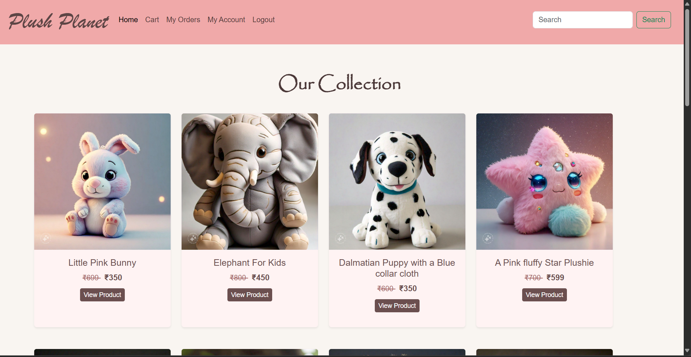

# **Plush Planet – E-commerce Platform 🛍️**

Plush Planet is a **full-stack e-commerce platform** built using **Node.js, Express.js, MongoDB, and EJS**. It allows users to browse, purchase soft toys, and manage orders efficiently.

### **🔗 Live Preview:** [Link to Demo](https://plush-planet.onrender.com/) *(Update if deployed)*

---

## **📌 Features**
✅ User Authentication & Authorization (JWT-based)  
✅ Product Listing & Management  
✅ Shopping Cart & Checkout  
✅ Order Processing & History  
✅ Image Uploads (Multer)  
✅ Secure Payments *(if applicable)*  
✅ Admin Dashboard *(if applicable)*  

---

## **🛠 Tech Stack**
- **Frontend:** EJS, Bootstrap, JavaScript
- **Backend:** Node.js, Express.js
- **Database:** MongoDB (Mongoose ODM)
- **Authentication:** JWT (JSON Web Token), bcrypt for password hashing
- **File Uploads:** Multer
- **Deployment:** Render / Vercel *(Update if deployed elsewhere)*

---


## **📸 Demo Screenshot**
**Login Page**
 *(Replace with actual screenshot)*

**Home Page**
 *(Replace with actual screenshot)*

---

## **📦 Packages Used**
| Package | Purpose |
|---------|---------|
| **express** | Web framework for Node.js |
| **mongoose** | MongoDB ODM for database interaction |
| **ejs** | Templating engine for dynamic content rendering |
| **bcrypt** | Secure password hashing |
| **jsonwebtoken (JWT)** | User authentication |
| **multer** | Image uploads |
| **dotenv** | Environment variable management |
| **express-session** | Session management |

---

## **🚀 Installation & Setup**
### **1️⃣ Clone the Repository**
```bash
$ git clone https://github.com/Bhavana-Mallineni/Plush-Planet.git
$ cd Plush-Planet
```

### **2️⃣ Install Dependencies**
```bash
$ npm install
```

### **3️⃣ Setup Environment Variables**
Create a `.env` file and configure the following:
```env
PORT=5000
MONGO_URI=your_mongodb_connection_string
JWT_SECRET=your_jwt_secret_key
```

### **4️⃣ Start the Server**
```bash
$ npm start
```
The server will run at `http://localhost:5000`

---

## **📜 License**
This project is **open-source** and available under the **MIT License**.

---

### **📬 Let's Connect!**
🔗 **Portfolio:** [Bhavana's Portfolio](https://www.bhavana_portfolio.com/)  
🔗 **LinkedIn:** [Bhavana Mallineni](https://www.linkedin.com/in/bhavana-mallineni-640184210/)  

